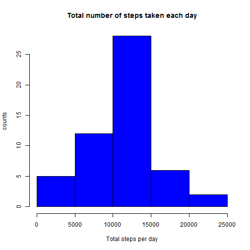
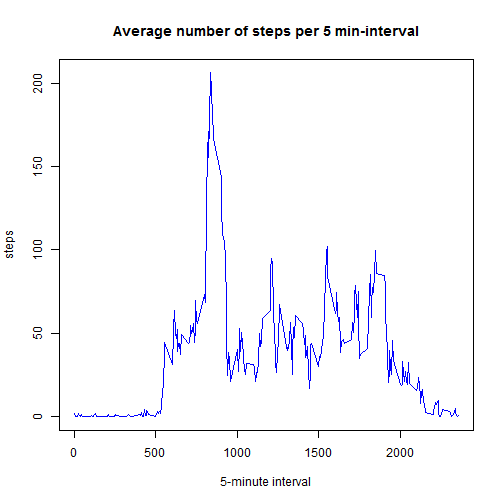
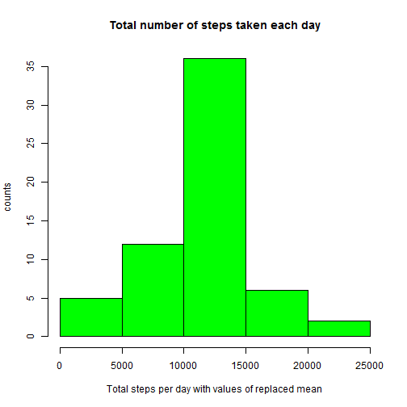
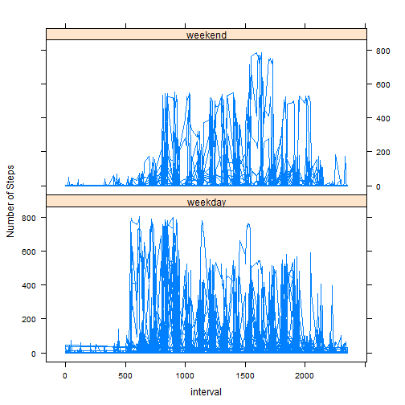

# Reproducible Research: Peer Assessment 1

>## Introduction
>
>It is now possible to collect a large amount of data about personal
>movement using activity monitoring devices such as a
>[Fitbit](http://www.fitbit.com), [Nike
>Fuelband](http://www.nike.com/us/en_us/c/nikeplus-fuelband), or
>[Jawbone Up](https://jawbone.com/up). These type of devices are part of
>the "quantified self" movement -- a group of enthusiasts who take
>measurements about themselves regularly to improve their health, to
>find patterns in their behavior, or because they are tech geeks. But
>these data remain under-utilized both because the raw data are hard to
>obtain and there is a lack of statistical methods and software for
>processing and interpreting the data.
>
>This assignment makes use of data from a personal activity monitoring
>device. This device collects data at 5 minute intervals through out the
>day. The data consists of two months of data from an anonymous
>individual collected during the months of October and November, 2012
>and include the number of steps taken in 5 minute intervals each day.
>
>## Data
>
>The data for this assignment can be downloaded from the course web
>site:
>
>* Dataset: [Activity monitoring data](https://d396qusza40orc.cloudfront.net/repdata%2Fdata%2Factivity.zip>) [52K]
>
>The variables included in this dataset are:
>
>* **steps**: Number of steps taking in a 5-minute interval (missing
>    values are coded as `NA`)
>
>* **date**: The date on which the measurement was taken in YYYY-MM-DD
>    format
>
>* **interval**: Identifier for the 5-minute interval in which
>    measurement was taken
>
>
>
>
>The dataset is stored in a comma-separated-value (CSV) file and there
>are a total of 17,568 observations in this
>dataset.
>
>
>## Assignment
>
>This assignment will be described in multiple parts. You will need to
>write a report that answers the questions detailed below. Ultimately,
>you will need to complete the entire assignment in a **single R
>markdown** document that can be processed by **knitr** and be
>transformed into an HTML file.
>
>Throughout your report make sure you always include the code that you
>used to generate the output you present. When writing code chunks in
>the R markdown document, always use `echo = TRUE` so that someone else
>will be able to read the code. **This assignment will be evaluated via
>peer assessment so it is essential that your peer evaluators be able
>to review the code for your analysis**.
>
>For the plotting aspects of this assignment, feel free to use any
>plotting system in R (i.e., base, lattice, ggplot2)
>
>Fork/clone the [GitHub repository created for this
>assignment](http://github.com/rdpeng/RepData_PeerAssessment1). You
>will submit this assignment by pushing your completed files into your
>forked repository on GitHub. The assignment submission will consist of
>the URL to your GitHub repository and the SHA-1 commit ID for your
>repository state.
>
>NOTE: The GitHub repository also contains the dataset for the
>assignment so you do not have to download the data separately.
>
>

**==============================================================================================================================**


## Loading and preprocessing the data

1. load the data (i.e. read.csv)


2. Process/transform the data (if necessary) into a format suitable for the current analysis


```r
## create a data frame 'activity' to store the data set
activity <- read.csv("activity.csv") ## read the data
```

**-----------------------------------------------------------------------------------------------------------------------------------**

## What is mean total number of steps taken per day?

### For this part of the assignment, you can ignore the missing values in the dataset


       1. Calculate the total number of steps taken per day


```r
## define a data frame 'activityDailySum' to store the data of the total number steps taken per day
activityDailySum <- aggregate(steps ~ date, data = activity, FUN=sum)

## the total number of steps taken per day, only display the 1st-20 steps values for the purpose of 
## demonstration
head(activityDailySum$steps, n=20)  
```

```
##  [1]   126 11352 12116 13294 15420 11015 12811  9900 10304 17382 12426
## [12] 15098 10139 15084 13452 10056 11829 10395  8821 13460
```


       2. If you do not understand the difference a histogram and a barplot,research the difference between
          them. Make a histogram of the total number of steps taken each day.


```r
hist(activityDailySum$steps, xlab="Total steps per day", ylab="counts", 
                             main="Total number of steps taken each day", 
                             col="blue")
```

 


       3. Calculate and report the mean and median of the total number of steps taken per day


```r
## The mean of the total number of steps taken per day
meanStepsDaily <- mean(activityDailySum$steps)
meanStepsDaily
```

```
## [1] 10766.19
```

```r
## The meadian of the total number of steps taken per day
medianStepsDaily <- median(activityDailySum$steps)
medianStepsDaily
```

```
## [1] 10765
```

## The mean and median of the total number of steps taken per day are 1.0766189 &times; 10<sup>4</sup> and 10765 respectively.


**------------------------------------------------------------------------------------------------------------**

## What is the average daily activity pattern?

    1. Make a time series plot (i.e. type = "l", ) of the 5-minute interval (x-axis) and 
       the average number of steps taken, averaged across all days (y-axis)
       

```r
## intervalAveSteps: the average number steps per 5-minute interval, averaged across all days
intervalAveSteps <- aggregate(steps ~ interval, data = activity, FUN=mean)

## make a time seriew plot of the 5-minute interval and the average number of steps taken,
## average across all days
plot(intervalAveSteps, type="l", xlab="5-minute interval",
          main="Average number of steps per 5 min-interval",
          col = "blue")
```

 

    2. Which 5-minute interval, on average across all the days in the dataset, contains the
       maximum number of steps?


```r
## find the 5-minute interval contains the maximum number of steps
intervalMaxNumberSteps <- intervalAveSteps$interval[which.max(intervalAveSteps$steps)]
intervalMaxNumberSteps
```

```
## [1] 835
```

**The 5-minute interval, on average across all the days in the datasets, contains the 
  maximum number of steps, is 835**


## In summary, the average daily activity pattern is the following:
##   * the 5-minute interval, on average daily activity pattern, contains the maximun numbers of steps, is 835


**------------------------------------------------------------------------------------------------------------**

## Imputing missing values

### Note that there are a number of days/intervals where there are missing values (coded as NA). The presence of missing days may introduce bias into some calculations or summaries of the data. 

    1. Calculate and report the total number of missing values  in the dataset (i.e. the total
       number of rows with NAs) 
       

```r
naNum <- sum(is.na(activity))
naNum
```

```
## [1] 2304
```

**The total number of missing values in the dataset (i.e. the total number of rows with NAs) is 2304**

    2. Devise a strategy for filling in all of the missing values 
       in the dataset. The strategy does not need to be sophisticated. For example, you could 
       use the mean/median for that day, or the mean for that 5-minute interval, etc.
             
  ---
  
            My strategy for filling in all of the missing values:
                - define a function to replace the missing data NA with the mean of the total number 
                  ofsteps taken per day
                - using the command 'ddply' in package plyr to create a temporary data frame with
                  the replaced data
                - reorder the temporary data frame because the plyr orders by group
                - named the reordered temporary data frame as 'activityNew'
                


```r
### define a function called 'imputeMean' to replace the missing data NA with
###    the mean of the total number of steps taken per day (daily mean steps)

    imputeMean <- function(x) replace(x, is.na(x), mean(x, na.rm = TRUE))
    
### Using the command 'ddply' in package plyr to create a temporary data frame 'tmpDFRM'
### with the imputed data. 
     library(plyr)
     tmpDFRM <- ddply(activity, ~interval, transform, steps = imputeMean(steps))     
```
     

     3. Create a new dataset that is equal to the original dataset but with the missing data filled in.


```r
### Need to reorder the new data frame due to the fact that plyr orders by group.
     activityNew <- tmpDFRM[with(tmpDFRM, order(date, interval)), ]
```


     4. Make a histogram of the total number of steps taken each day and Calculate and report the mean
      and median total number of steps taken per day. Do these values differ from the estimates from 
      the first part of the assignment? What is the impact of imputing missing data on the estimates 
      of the total daily number of steps?


```r
## define a new data frame 'activityNewDailySum' to store the data with the total number of 
## steps taken per day
activityNewDailySum <- aggregate(steps ~ date, data = activityNew, FUN=sum)

## plot a historgram of the total number of steps taken each day
hist(activityNewDailySum$steps, xlab="Total steps per day with replaced mean values", ylab="counts", 
                             main="Total number of steps taken each day", 
                             col="green")
```

 

```r
## The mean of the total number of steps taken per day from the new data frame
meanNewStepsDaily <- mean(activityNewDailySum$steps)
meanNewStepsDaily
```

```
## [1] 10766.19
```

```r
## The meadian of the total number of steps taken per day from the new data frame
medianNewStepsDaily <- median(activityNewDailySum$steps) 
medianNewStepsDaily
```

```
## [1] 10766.19
```

**The mean and the median total number of steps taken per day is 1.0766189 &times; 10<sup>4</sup> and1.0766189 &times; 10<sup>4</sup>. The impact of imputing missing data on the estimates of the total
daily number of steps is very small.**


**------------------------------------------------------------------------------------------------------------**

## Are there differences in activity patterns between weekdays and weekends?

###   For this part the weekdays() function may be of some help here. 
###   Use the dataset with the filled-in missing values for this part. 
  
      1. Create a new factor variable in the dataset with two levels - "weekday" and "weekend" 
         indicating whether a given date is a weekday or weekend day.
  

```r
         ## create a new factor variable "weekday" indicating whether a given date
         ## is a weekend or weekday and add to the new data set 'activityNew'
         
         activityNew$weekday <- weekdays(strptime(activityNew$date, format="%Y-%m-%d"))
         weekend <- (activityNew$weekday == "Saturday") | (activityNew$weekday == "Sunday")
         activityNew$weekday[weekend]  <- "weekend"
         activityNew$weekday[!weekend] <- "weekday"
```
           
       2. Make a panel plot containing a time series plot (i.e. type = "l") of the 5-minute interval 
          (x-axis) and the average number of steps taken, averaged across all weekday days or weekend
           days (y-axis). See the README file in the GitHub repository to see an example of what this 
           plot should look like using simulated data.


```r
  ## using command 'xyplot' in lattice package to plot the required figure.
       require("lattice")

       xyplot(steps ~ interval | weekday, data = activityNew, layout=c(1,2), type="l",
              ylab = 'Number of Steps')
```

 

### Yes, there are differences in activity patterns between weekdays and weekends. The activities in the weekdays are more intenive than in weekend.

**======================================================================================================================================**

